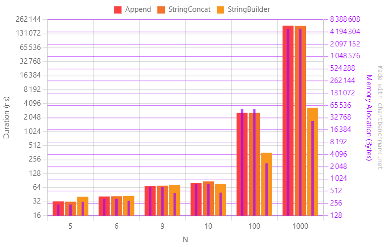
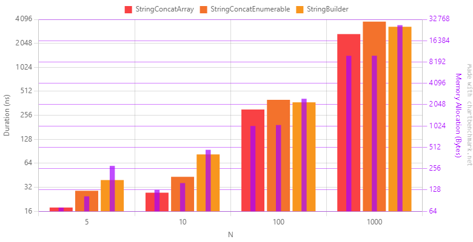

Recently, I've had a conversation with Davide Bellone, on LinkedIn about the different strategies of string concatenation and their relative performance (You can read its post [here](https://www.linkedin.com/posts/bellonedavide_csharp-dotnet-activity-7147651609035001856-KsnO?utm_source=share&utm_medium=member_desktop)).

His take was that, even though the built-in class `StringBuilder` is generally the most performant way to concatenate string, it isn't always the best choice, especially with fewer items.  
To prove his point, he showed the benchmark he ran with the associated code :

```csharp
public void Append()
{
    var value = "";

    foreach(var item in items)
    {
        value += item;
    }
}

public void StringConcat()
{
    var value = "";

    foreach(var item in items)
    {
        value = string.Concat(value, item);
    }
}

public void StringBuilder()
{
    var sb = new StringBuilder();

    foreach(var item in items)
    {
        sb.Append(item);
    }

    var value = sb.ToString();
}
```
Here are the results:

(N=6 and N=9 are included to show the tipping point of memory and CPU consumption)

I'm not writing this article to debate the efficiency of `StringBuilder`. However, it's not the most performant way to concatenate a collection of strings. Contrary to what is shown on the benchmark, `string.Concat` is - and **by far** - the most efficient way. The reason for its bad results in the previous benchmark is simply a misuse: `string.Concat` is meant to concatenate multiple items at once, not one by one.

Here is the fixed implementation of the benchmark code :
```csharp
public void StringConcat()
{
    var value = string.Concat(items);
}

```
Then, here are the new results:


We can see that `string.Concat` outperforms the other strategies, especially with a low amount of items. This kind of performance is possible because of the underlying algorithm of `string.Concat`: it allocates a unique string which is as long as the summed items' length, then it copies every item in the newly created string.
You can see the implementation [here](https://source.dot.net/#System.Private.CoreLib/src/libraries/System.Private.CoreLib/src/System/String.Manipulation.cs,75e4bdc056f3daf0). This also means that such an algorithm is not possible when enumerable (counting items of an enumerable is slow), so they use another implementation ([here](https://source.dot.net/#System.Private.CoreLib/src/libraries/System.Private.CoreLib/src/System/String.Manipulation.cs,206408f6325aea24)). This second implementation uses an internal string builder called `ValueStringBuilder` (implementation [here](https://source.dot.net/#System.Text.RegularExpressions/src/libraries/Common/src/System/Text/ValueStringBuilder.cs,157e1a7ce4de87da)) which focuses on memory consumption.

Even though, benchmarks show that ValueStringBuilder runs a bit slower than StringBuilder, it also consumes less than half the memory (beware the scale is logarithmic):


As conclusion:
- `string.Concat` is, by far, the best method to concatenate an in-memory collection (length is known) of strings 
- `StringBuilder` is the best, otherwise

You can find the benchmark code [here](https://github.com/rchoffardet/dotnet-benchmarks/blob/main/Rchoffardet.Benchmarks/StringConcatenation/DavideBenchmark.cs) for the original version and [here](https://github.com/rchoffardet/dotnet-benchmarks/blob/main/Rchoffardet.Benchmarks/StringConcatenation/FixedDavideBenchmark.cs) for my fixed version and additions