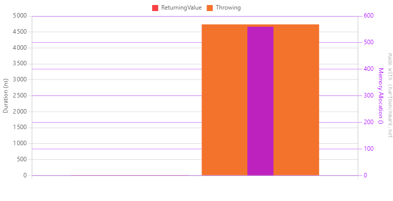
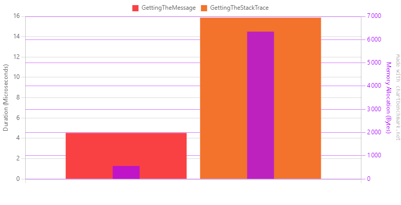
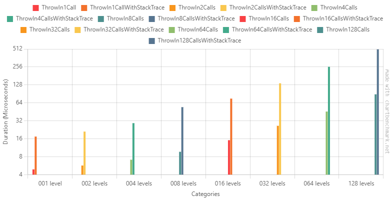
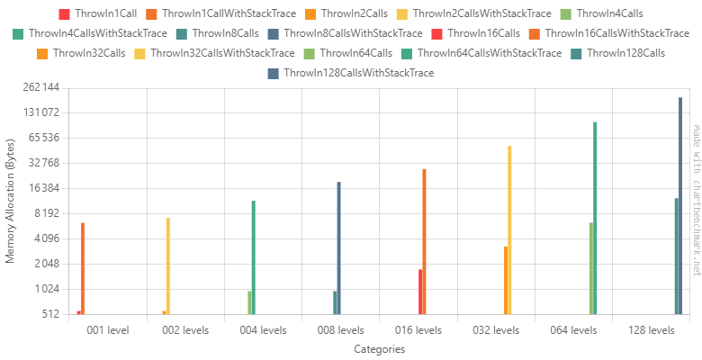
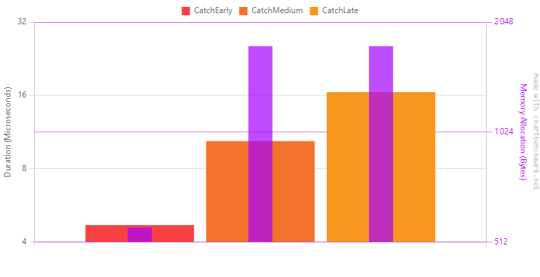
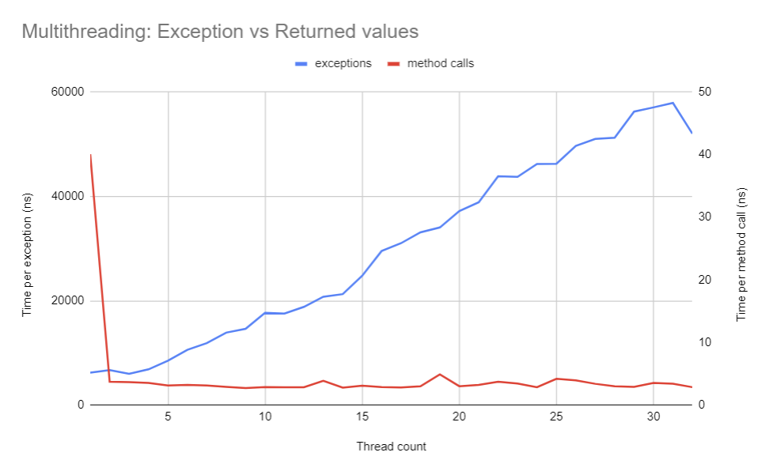

# Exception pattern

I had some discussions about exceptions at work, especially for performance reasons: We maintain a platform that has both high volumetry and low latency constraints. The document made by one of my teammates (Hi Olivier!👋) included observations that I didn't know or that I heard about, but never had the opportunity to verify. This made me want to dig a bit deeper and learn more about this topic. This article is the result of my findings.

## What are exceptions?

Throwing exceptions is the default way to deal with errors in dotnet. It's a common way of handling errors in a lot of languages, especially those inspired by Java. Even if there are subtilities in the implementations, the global mechanism is the same.

You _throw_ an exception and then you _catch_ it higher in the call chain.

An exception is an object with some data associated (a message, parameters, ...) when you throw it, the current execution stops and the exception goes up the call chain until it is caught or the program entry point is reached (then, the program crashes).  
When thrown, additional contextual information, such as the stack trace, is added to the exception.  
When caught, additional behavior can be added to the program such as logging, returning a fallback value or even doing nothing.

The major benefit of exceptions is the simplicity of their usage and its versatility. It's very convenient: You can throw them from anywhere, and catch them anywhere higher in the execution flow. Dotnet offers quite some tools to handle exceptions as we see fit.

```csharp
try
{
    // code that throws
    throw new MyCustomException();
}
// will catch only exception of type `MyCustomException`
catch(MyCustomException ex)
{
    throw ex; // will rethrow the exception with a new stack trace
}
// will catch every exceptions with the specific message
catch(Exception ex) when (ex.Message == "My specific error message")
{
    throw; // will rethrow the exception as it was caught
}
// will catch every exceptions
catch(Exception ex)
{ }
// will be executed weither an exception was caught or none was trown
finally
{ }
```
These capabilities come at a cost. I have heard or read multiple times about their supposed bad performances.
Is it that bad? Should we avoid them? What are the alternatives?

## Performance implications

Exceptions are said to be costly for at least two main reasons:
- It has a specific flow outside of the normal flow
- It points to the location of the error thanks to the stack trace

When throwing an exception, the runtime has to rewind the execution flow to find a try block with a catch block that matches the current exception or it must keep going. It also has to build a stack trace which is the chain of methods call from the program entry point to the location of the exception throw.

It does sound costly. But what are the numbers?

### Throwing vs returning a value



```text
| Method         | Mean         | Error        | StdDev     | Gen0   | Allocated |
|--------------- |-------------:|-------------:|-----------:|-------:|----------:|
| ReturningValue |     1.782 ns |     1.511 ns |  0.0828 ns |      - |         - |
| Throwing       | 4,739.984 ns | 1,081.137 ns | 59.2608 ns | 0.0381 |     560 B |
```


The difference is so big that the bars associated with the code returning a value aren't even shown on the graph. Exceptions are around 3000 times more expensive than a return statement. It also allocates some memory, I assume it's because of the message of the thrown exception. It could also be for internal data of the exception.

### Stack trace penalty



```text
| Method               | Mean      | Error    | StdDev    | Gen0   | Allocated |
|--------------------- |----------:|---------:|----------:|-------:|----------:|
| GettingTheMessage    |  4.532 us | 2.233 us | 0.1224 us | 0.0381 |     560 B |
| GettingTheStackTrace | 15.878 us | 3.690 us | 0.2023 us | 0.4883 |    6345 B |
```


As expected, retrieving the stack trace is more costly (about 2.5x more) and does much more allocations (about 10x more!). The stack trace is a big string so it makes sense.

### Depth penalty

To readability, here are the duration graph measuring the CPU consumption and the allocation graph measuring the memory consumption, separated.

```text
| Method                        | Categories | Mean       | Error       | StdDev    | Gen0    | Gen1   | Allocated |      
|------------------------------ |----------- |-----------:|------------:|----------:|--------:|-------:|----------:|      
| ThrowIn1Call                  | 001 level  |   4.890 us |   0.8690 us | 0.0476 us |  0.0381 |      - |     560 B |      
| ThrowIn1CallWithStackTrace    | 001 level  |  17.379 us |   1.3236 us | 0.0726 us |  0.4883 |      - |    6376 B |
|                               |            |            |             |           |         |        |           |      
| ThrowIn2Calls                 | 002 levels |   5.681 us |   0.1936 us | 0.0106 us |  0.0381 |      - |     560 B |      
| ThrowIn2CallsWithStackTrace   | 002 levels |  21.069 us |   3.8731 us | 0.2123 us |  0.5798 |      - |    7304 B |      
|                               |            |            |             |           |         |        |           |      
| ThrowIn4Calls                 | 004 levels |   7.095 us |   0.9524 us | 0.0522 us |  0.0763 |      - |     968 B |      
| ThrowIn4CallsWithStackTrace   | 004 levels |  29.203 us |   9.3638 us | 0.5133 us |  0.9155 |      - |   11737 B |      
|                               |            |            |             |           |         |        |           |      
| ThrowIn8Calls                 | 008 levels |   9.648 us |   0.7217 us | 0.0396 us |  0.0763 |      - |     968 B |      
| ThrowIn8CallsWithStackTrace   | 008 levels |  54.139 us |   5.5793 us | 0.3058 us |  1.4648 |      - |   19721 B |      
|                               |            |            |             |           |         |        |           |
| ThrowIn16Calls                | 016 levels |  15.111 us |   2.5158 us | 0.1379 us |  0.1373 |      - |    1760 B |      
| ThrowIn16CallsWithStackTrace  | 016 levels |  75.288 us |  32.8789 us | 1.8022 us |  2.1973 |      - |   28154 B |      
|                               |            |            |             |           |         |        |           |      
| ThrowIn32Calls                | 032 levels |  26.314 us |   1.6150 us | 0.0885 us |  0.2441 |      - |    3320 B |      
| ThrowIn32CallsWithStackTrace  | 032 levels | 136.082 us |  31.8375 us | 1.7451 us |  4.1504 | 0.2441 |   53262 B |      
|                               |            |            |             |           |         |        |           |      
| ThrowIn64Calls                | 064 levels |  45.701 us |   3.8151 us | 0.2091 us |  0.4883 |      - |    6416 B |      
| ThrowIn64CallsWithStackTrace  | 064 levels | 257.381 us |  63.1832 us | 3.4633 us |  7.8125 | 1.4648 |  102939 B |      
|                               |            |            |             |           |         |        |           |      
| ThrowIn128Calls               | 128 levels |  88.841 us |  27.0890 us | 1.4848 us |  0.9766 |      - |   12584 B |      
| ThrowIn128CallsWithStackTrace | 128 levels | 504.649 us | 141.4478 us | 7.7532 us | 15.6250 |      - |  203009 B |
```


#### CPU


#### Memory


Although the CPU seems to be more or less related to the depth (between 1.5 and 2 ratio when the depth doubles), the allocated memory grows in an accelerated fashion when the stack trace is retrieved. Having a depth of 128 nested calls could be considered absurd but it's not. With async/await, iterators, lambdas and others, it's not uncommon to have a depth of several hundred methods.

### Catching early vs catching late

In the benchmark, the goal was to determine the impact of the depth of the catch block.
The three snippets are all nested at the same level (20 nested calls). In the first one, the exception is thrown and caught immediately after 20 nested calls. In the second one, the exception is caught midway. In the last one, the exception is caught at the top of the nested calls.



```text
| Method      | Mean      | Error     | StdDev    | Gen0   | Allocated |
|------------ |----------:|----------:|----------:|-------:|----------:|
| CatchEarly  |  4.686 us | 2.0421 us | 0.1119 us | 0.0381 |     560 B |
| CatchMedium | 10.376 us | 0.5524 us | 0.0303 us | 0.1373 |    1760 B |
| CatchLate   | 16.500 us | 9.1093 us | 0.4993 us | 0.1221 |    1760 B |
```


Catching early seems to compensate for the bad effect of depth. 

### CPU contention



Throwing exceptions is expected to be unrelated to thread count. However, contrary to the method calls (whose curve stays relatively flat) exceptions take an increasing amount of time to be thrown and caught. This shows a form of thread contention.

I think that it is the biggest issue of all. Thus, I've opened an [issue](https://github.com/dotnet/runtime/issues/97181) on the `dotnet/runtime` GitHub repository.

## DX implication

One important thing about them is that they are implicit. They are not part of the public API. Thus, there is no way to tell if a method throws an exception unless you read its implementation and recursively every implementation of the methods it calls. One way to deal with that would be to rely on _documentation comments_ (when they exist) like dotnet has. This is handy, but as it's not a general habit, it's not a reliable solution. There is no general solution to address this issue, it's a kind of gray area where programmers do what they can/want.

There is a whole debate about whether dotnet should have _checked exceptions_ like Java or not. The fact is, _checked exceptions_ have drawbacks too and it resolves in a matter of opinions. If you want to read more about the drawbacks of _checked exceptions_, see [this blog post](https://www.artima.com/articles/the-trouble-with-checked-exceptions).

## Should we avoid them?

Yes **AND** no. As always, it depends. Exceptions are way too convenient to be overlooked.
There is a reason why there is an exception system in most languages: its convenience.

Systems that are so constrained by performance needs that they cannot use exceptions are not common at all.
I never saw such systems (at least not in dotnet). So, good chances are that we can keep using them for a while.
However, we can limit their usage to the minimum.

Microsoft recommends using exceptions only for exceptional cases, outside of normal flow.
Business rules, data validation, data parsing, ... should be done without exceptions.

We'll see other ways to handle errors in future articles.

## TL;DR
- Exceptions are slow and memory-hungry
- In terms of DX, they have drawbacks, but their benefits outweigh them
- Microsoft recommends keeping their usage to the minimum

Please, let me know if I made mistakes and/or if any passages are unclear.
Don't hesitate to react or comment below, I will gladly reply to your comments.