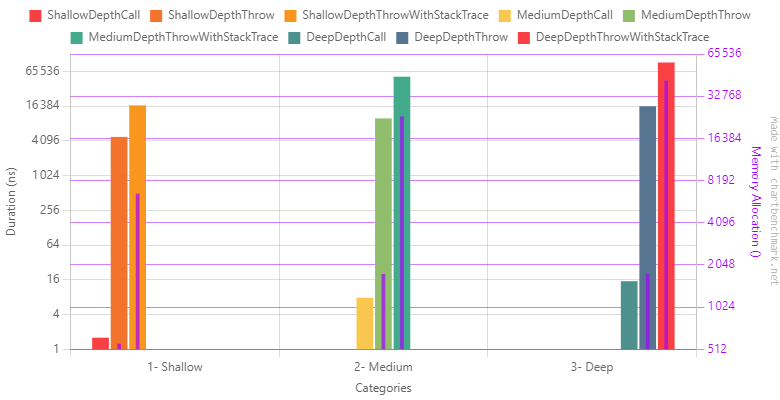

# Exception pattern

Throwing exceptions is the default way to deal with errors in dotnet. It's also a common way of handling a lot of languages, especially those inspired by Java. Even if there are subtilities in the implementation of the different languages, the global mechanism is the same.

You _throw_ an exception and then you _catch_ it higher in the call chain.

An exception is an object with some data associated (a message, parameters, ...) when you throw it, the current execution stops and the exception goes up the call chain until it is caught or the program crashes. When thrown, additional contextual information, such as the stack trace, is added to the exception. When caught, additional behavior can be added to the program such as logging, returning a fallback value or even doing nothing.

The major benefit of exceptions is the simplicity of their usage and its versatility. It's very convenient: You can throw them from anywhere, and catch them anywhere you like. Dotnet offers a quite complete way to catch exceptions, precisely: by its type in the `catch` block which can be augmented by a when expression.

```csharp
try
{
    // code that throws
    throw new MyCustomException();
}
catch(MyCustomException ex)
{
    // will catch only exception of type `MyCustomException`
}
catch(Exception ex) when (ex.Message == "My specific error message")
{
    // will catch every exceptions with the specific message
}
catch(Exception ex)
{
    // will catch every exceptions
}
finally
{
    // will be executed weither an exception was caught or not trown
}
```

## Implictness

One important thing about them is that they are implicit. They are not part of the public API. So there is no way to tell if a method throws an exception unless you read its implementation and recursively every implementation of the methods it calls. Some library authors (like Microsoft) document them in _documentation comments_ of a method. This is helpful. But not everybody does that and there is no certainty of the exactitude of these comments: they are not enforced by the compiler.

According to its documentation `System.IO.File.ReadAllLines(string path)` can throw 9 different types of exceptions :
- `System.ArgumentException`
- `System.IO.PathTooLongException`
- `System.IO.DirectoryNotFoundException`
- `System.IO.IOException`
- `System.UnauthorizedAccessException`
- `System.IO.FileNotFoundException`
- `System.NotSupportedException`
- `System.Security.SecurityException`

This is a pain to deal with rigorously, just imagine having to scan the code as well. 
So, of course, this led developers to not catch them at all or to put them in a tote bagged exception with a very generic message: "Something wrong happened". More globally, exception handling is difficult and subjective,  

## Performance

I had discussions over this topic (exception performance) with my teammates at work. One of them (Hi Olivier!👋) was leading the debate and triggered my curiosity about this subject. I like to think that these discussions were the starting point of this article 😄  




```text
| Method                          | Categories | Mean          | Error          | StdDev      | Ratio     | RatioSD | Gen0   | Gen1   | Allocated | Alloc Ratio |
|-------------------------------- |----------- |--------------:|---------------:|------------:|----------:|--------:|-------:|-------:|----------:|------------:|
| ShallowDepthCall                | 1- Shallow |      1.584 ns |      1.8373 ns |   0.1007 ns |      1.00 |    0.00 |      - |      - |         - |          NA |
| ShallowDepthThrow               | 1- Shallow |  4,787.440 ns |    294.9303 ns |  16.1661 ns |  3,031.18 |  188.65 | 0.0381 |      - |     560 B |          NA |
| ShallowDepthThrowWithStackTrace | 1- Shallow | 16,883.315 ns |  2,013.6345 ns | 110.3741 ns | 10,691.88 |  717.06 | 0.5188 |      - |    6592 B |          NA |
|                                 |            |               |                |             |           |         |        |        |           |             |
| MediumDepthCall                 | 2- Medium  |      7.785 ns |      0.7519 ns |   0.0412 ns |      1.00 |    0.00 |      - |      - |         - |          NA |
| MediumDepthThrow                | 2- Medium  | 10,012.737 ns |  2,326.8240 ns | 127.5411 ns |  1,286.17 |   14.43 | 0.1373 |      - |    1760 B |          NA |
| MediumDepthThrowWithStackTrace  | 2- Medium  | 52,944.796 ns |  1,149.3988 ns |  63.0024 ns |  6,801.12 |   42.58 | 1.8311 |      - |   23497 B |          NA |
|                                 |            |               |                |             |           |         |        |        |           |             |
| DeepDepthCall                   | 3- Deep    |     15.088 ns |      3.5429 ns |   0.1942 ns |      1.00 |    0.00 |      - |      - |         - |          NA |
| DeepDepthThrow                  | 3- Deep    | 16,297.076 ns |  3,004.9562 ns | 164.7118 ns |  1,080.15 |    7.53 | 0.1221 |      - |    1760 B |          NA |
| DeepDepthThrowWithStackTrace    | 3- Deep    | 93,299.382 ns | 11,298.9882 ns | 619.3357 ns |  6,184.23 |   89.13 | 3.1738 | 0.2441 |   42266 B |          NA |
```


As you can see, throwing exception costs multiple orders of magnitude more than simply returning a value. 
It's even more when the stack trace is consumed. Beware, the scale is logarithmic, there is a 4x factor between throwing exceptions without and with stack trace. This is huge! 

### CPU contention

- most common pattern
- very convenient
- poor performance at scale
- implicitness
- break the flow
- embbed a lot of contextual information 
