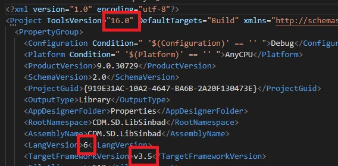
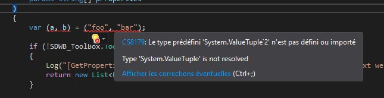

Si vous développez sur de vieilles solutions en .NET 3.5 et que vous voulez quand même utiliser une version de C# "récente" :
- Assurez-vous que sur ATEL, le projet est buildée par une version qui supporte la version de C# désirée ([voir le joli tableau](https://cdiese.fr/csharp7#cs7-introduction-Precisions_sur_les_versions))
- Puis renseignez ces informations dans le csproj



c'est notamment intéressant quand on a une librairie en .NET 3.5 et qu'on veut utiliser l'interpolation de chaîne :
```csharp
var user = "bob";
// Avant
var str = string.Format("hello {0}", user);
// Après
var str = $"hello {user}";
```

**MAIS** il est possible que certaines fonctionnalités des "nouveaux" langages ne soient pas compatibles avec la version de .NET ciblée.
Dans le cas de l'interpolation de chaîne, pas de soucis, le code généré est le même :)
Pour les "nouveaux tuples", ce n'est en revanche pas la même histoire :


