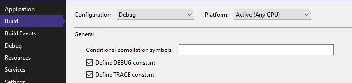
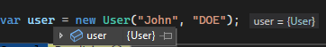
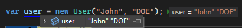
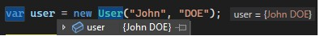

## Affichage des données dans la sortie de debug de Visual Studio 

La classe `System.Diagnostics.Debug` possède des méthodes utilitaires pour débugger le code.
Elle possède par exemple une méthode pour écrire dans la fenêtre d'output de visual studio ("Debug" -> "Windows" -> "Output")
Exemple d'usage:
```csharp
System.Diagnostics.Debug.WriteLine(" ")
```
C'est assez pratique pour afficher le temps d'exécution entre deux methodes ou autre

## Inclusion conditionnel lors de la compilation
Théoriquement, il serait possible de laisser les appels à `Debug.WriteLine` dans le code de production. 
Ceux-ci sont (normalement) retiré durant la compilation en mode Release (comme le fait ATEL).

En fait, c'est le cas de toutes les méthodes  de la classe `System.Diagnostics.Debug`.
Cette classe possède notamment une méthode d'assertion `Debug.Assert` qui permet d'échouer quand on lui fourni `false`.
Elle n'est pas exécutée lorsque le code est compilé en mode Release.

Ce mécanisme utilise l'attribut `ConditionalAttribute` qui permet de supprimer des appels aux méthodes en fonction de la présence ou non de flags lors de la compilation.
En l'occurence, les méthodes de la classe `System.Diagnostics.Debug` écoute le flag `DEBUG`:
```csharp
[Conditional("DEBUG")]
public static void WriteLine(string? message) => Debug.s_provider.WriteLine(message);
```

Ces flags sont activables dans le csproj :
```xml
<PropertyGroup Condition=" '$(Configuration)|$(Platform)' == 'Debug|AnyCPU' ">
    <DefineConstants>DEBUG;TRACE</DefineConstants>
</PropertyGroup>
```
Ou bien via l'interface :


Grâce à ces mécanismes, on pourrait par exemple imaginer laisser des timers dans le code.
Ils seraient conditionnés par un flag et donc activables/désactivables à loisir sans impact au runtime sur le code de production :)

## Prévisualisation lors du debugging

Quand on survole une variable dans visual studio en mode debug, on a un aperçu de la valeur.
De base, on voit la valeur retournée par `ToString()` si on ne l'a pas surchargé, c'est généralement le nom du type.
Pas très très utile.
Il existe deux solutions à cela :
- Surcharger la méthode ToString()
- Utiliser l'attribut [DebuggerDisplay(""}] 

La string en paramètre de DebuggerDisplay est interpolée.
Ce qui permet de faire ceci :
```csharp
[DebuggerDisplay("{firstname} {lastname}")]
public class User
{
    public readonly string firstname;
    public readonly string lastname;

    public User(string firstname, string lastname)
    {
        this.firstname = firstname;
        this.lastname = lastname;
    }
}
```
Sans l'attribut on a :  


Et avec :  


On surcharcheant la méthode `ToString()`:
```csharp
public override string ToString()
{
    return $"{firstname} {lastname}";
}
```

on obtient alors :  


